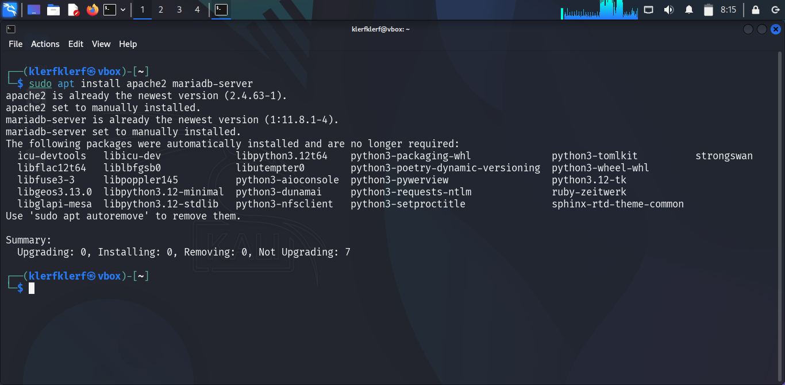
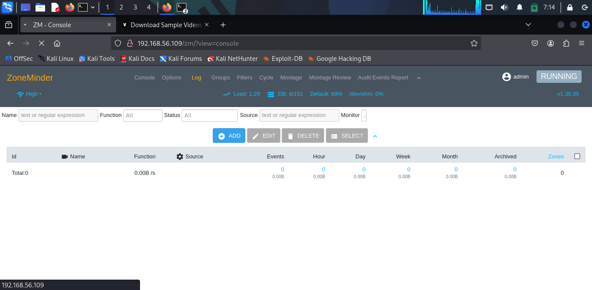
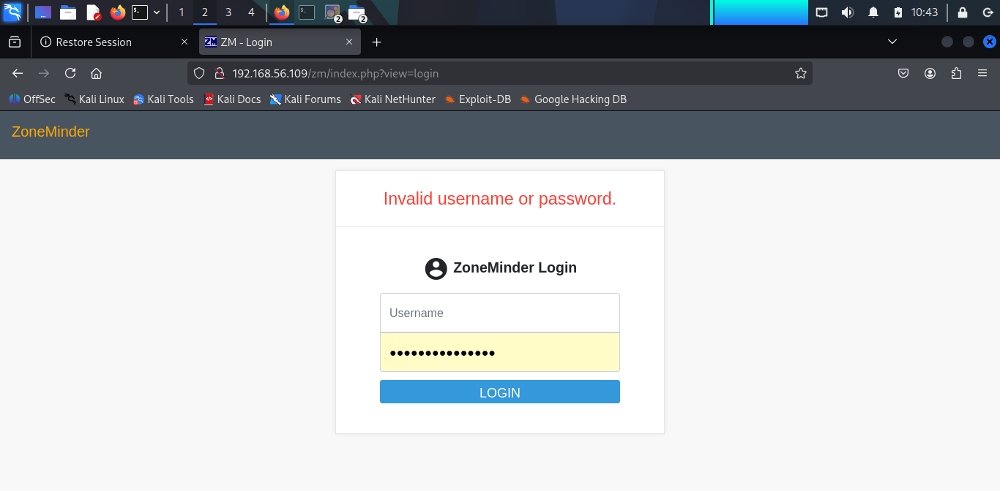

# CCTV System Hacking

This project is journey into setting up a simulated CCTV system using ZoneMinder on a Kali Linux VM, exploring its vulnerabilities, and exploiting them as an ethical hacker. I completed this on **10:46 PM GMT, Thursday, June 05, 2025**, in a controlled lab environment using VirtualBox with a host-only network. My goal was to understand how attackers might compromise a CCTV system and provide recommendations to secure it.

**Disclaimer**: This project was conducted in an isolated lab environment for educational purposes only. Hacking real CCTV systems without permission is illegal and unethical.

---

## Project Overview
- **Objective**: I wanted to install ZoneMinder, simulate live CCTV footage, scan for vulnerabilities, exploit the system, and suggest mitigations.
- **Environment**:
  - Target VM: Kali Linux (`192.168.56.109`) running ZoneMinder.
  - Attacker VM: Kali Linux (`192.168.56.102`) for scanning and exploitation.
  - Network: Host-only network (`192.168.56.0/24`) to keep everything isolated.
- **Tools Used**: VirtualBox, ZoneMinder, mediamtx, FFmpeg, FFplay, Nmap, Gobuster, Hydra, Burp Suite.

NOTE : RTSP is a protocol for streaming media over a network.
---

## Setting Up the Environment

I needed a safe, isolated setup with two VMs to simulate a target CCTV system and an attacker machine. A host-only network ensured no external access, keeping my experiments secure.

### Steps
1. I started by updating my Kali Linux VM:
     ```bash
     sudo apt update && sudo apt upgrade -y
     ```


2. I ran:
   ```
   sudo apt install -y software-properties-common
   ```
   This tool helps manage repositories, which I needed for ZoneMinder.


## Installing ZoneMinder

I chose ZoneMinder as my CCTV software because it’s open-source and widely used. I followed the official documentation at [HERE](https://zoneminder.readthedocs.io/en/latest/installationguide/debian.html) using the Debian 12 (Bookworm) method, since Kali Linux is Debian-based.

### Steps
1. I installed Apache web server and MariaDB database:
   ```
   sudo apt install -y apache2 mariadb-server
   ```


   These are required for ZoneMinder’s web interface and data storage.
2. Since MariaDB was disabled, I started it manually:
   ```
   sudo systemctl start mariadb
   ```
   I needed the database running to create ZoneMinder’s database.


3. I entered the MariaDB shell to create Zoneminder Database:
   ```
   sudo su
   mariadb
   ```
   Then created the database and user:
   ```
   CREATE DATABASE zm;
   CREATE USER 'zmuser'@'localhost' IDENTIFIED BY 'zmpass';
   GRANT ALL ON zm.* TO 'zmuser'@'localhost';
   FLUSH PRIVILEGES;
   exit
   exit
   ```
   This set up the database for ZoneMinder to store its data.


4. I installed Zoneminder:
   ```
   sudo apt install -y zoneminder
   ```
   This added ZoneMinder to my system.


5. I configured the database:
   ```
   mariadb -u zmuser -p zm < /usr/share/zoneminder/db/zm_create.sql
   ```
   Entered `zmpass` when prompted for password.
   This populated the database with ZoneMinder’s schema.

6. I adjusted permissions to ensure ZoneMinder could read its configuration:
   ```
   sudo chgrp -c www-data /etc/zm/zm.conf
   ```
   Proper permissions are needed for ZoneMinder to function.


7. I enabled CGI and restarted Apache:
   ```
   sudo a2enmod cgi
   sudo systemctl restart apache2
   ```
   Apache needs CGI for ZoneMinder’s web interface.


8. I checked and started the service:
   ```
   sudo systemctl status zoneminder
   sudo systemctl enable zoneminder
   sudo systemctl start zoneminder
   ```
   This ensured ZoneMinder was running and would start on boot.


9. Accessing ZoneMinder:
    I visited `http://192.168.56.109/zm` and logged in authomatically without credentials since authentication wasn’t enabled initially. I then enabled authentication from Zoneminder's options. I explored the interface to get familiar with it. This confirmed ZoneMinder was working.





## Simulating CCTV Footage
ZoneMinder doesn’t natively play static MP4 files, so I needed to simulate a live feed. I downloaded a sample MP4 from `sample-videos.com` to act as my CCTV footage, as it provided a realistic video to stream.

### Steps
1. I downloaded a sample MP4:
   ```
   sudo wget https://sample-videos.com/video321/mp4/720/big_buck_bunny_720p_30mb.mp4 -O /var/lib/zoneminder/videos/sample2.mp4
   sudo chown www-data:www-data /var/lib/zoneminder/videos/sample2.mp4
   sudo chmod 644 /var/lib/zoneminder/videos/sample2.mp4
   ```
   This video became my simulated live feed, and proper permissions ensured ZoneMinder could access it.


2. I downloaded and set up mediamtx (RTSP Server) from Github:
   ```
   wget https://github.com/bluenviron/mediamtx/releases/download/v1.12.3/mediamtx_v1.12.3_linux_amd64.tar.gz
   tar -xvzf mediamtx_v1.12.3_linux_amd64.tar.gz
   ./mediamtx
   ```
   Mediamtx streams the video over RTSP, which ZoneMinder can monitor, simulating a live camera feed.


3. I streamed the footage with FFmpeg:
   Initially, I tried a simpler FFmpeg command, but the video lagged. I adjusted it to:
   ```
   ffmpeg -re -stream_loop -1 -i /var/lib/zoneminder/videos/sample2.mp4 -c:v libx264 -preset ultrafast -tune zerolatency -c:a aac -f rtsp rtsp://192.168.56.109:8554/mystream
   ```
   This command takes the sample2.mp4 file, encodes it in real-time using the H.264 video codec (libx264) and AAC audio codec, optimizes for low latency and high speed (ultrafast and zerolatency), and streams it continuously as an RTSP feed to rtsp://192.168.56.109:8554/mystream. The -re and -stream_loop -1 options ensure it behaves like a live, uninterrupted CCTV feed, which you used to simulate footage in ZoneMinder.


4. I added a monitor in ZoneMinder named simcamera:
   ```
   Source Type: Remote
   Protocol: RTSP
   Method: RTP/Unicast
   Hostname: 192.168.56.109
   Port: 8554
   Path: /mystream
   Resolution: 1280x720
   ```
   I saved it, but it didn’t capture. I therefore restarted ZoneMinder:
   ```
   sudo systemctl restart zoneminder
   ```
   It started capturing, but I couldn’t view the feed in ZoneMinder, possibly due to dimension mismatches or configuration issues.
   The restart fixed the capture, but the dimension issue suggested a compatibility problem with ZoneMinder’s display. Therefore I had to verify the feed with `ffplay`
   ```
   sudo apt install -y ffmpeg
   ```
   I played the stream:
   ```
   ffplay rtsp://192.168.56.109:8554/mystream
   ```
   Result: The video played live, confirming the RTSP setup worked.
   FFplay validated the stream outside ZoneMinder, proving the issue was with ZoneMinder’s interface.


5. I added a few users in ZoneMinder under "Options" > "Users" for testing.


## Scanning the Target
Now, with Zoneminder set up on the 'supposed' target, I wanted to identify open ports and services on the target VM to plan my attack, simulating an attacker’s reconnaissance phase.

### Steps
1. I run a simple Nmap Scan:
   On the attacker VM (192.168.56.102), I ran:
   ```
   nmap 192.168.56.109
   ```
   I noticed port 8554 (RTSP) wasn’t open, which surprised me since mediamtx was running. I checked but wasn't a firewall issue.
   I focused on port 80, which was open alongside other ports.
   Nmap helped me find a web server, a potential entry point.


2. I checked the Web Server:
   I visited `http://192.168.56.109` in Firefox and saw the Apache2 default page.
   This confirmed port 80 was active but didn’t reveal ZoneMinder directly.


## Exploitation
   I exploited the system to see how an attacker could gain access, using the tools and techniques I learned.

### Steps
1. I enumerated directories with Gobuster:
   I ran:
   ```
   gobuster dir -u http://192.168.56.109 -w /usr/share/wordlists/dirb/common.txt
   ```


   `/zm` wasn’t listed, so I edited `common.txt` to add zm (for simulation purposes)


   I reran Gobuster and found `http://192.168.56.109/zm`.
   This revealed the ZoneMinder directory, a critical step in the attack.


2. I captured Login Request with Burp Suite:
   I visited `http://192.168.56.109/zm`, entered a random username and password, and intercepted the POST request with Burp Suite.
   The login failed, yes, exactly what I wanted but Burp didn’t capture a "Login failed" message. I used the form’s error message ("Wrong username or password") from the browser.
   This gave me the exact POST structure for Hydra.




3. I created a Brute-Force attack with Hydra:
   - I created a small username list:

   - Initially, I tried `rockyou.txt`, but it was too slow. I created a smaller password list for the attack:
   - Finally, I ran the attack:
   ```
   hydra -L usernames.txt -P passwords.txt 192.168.56.109 http-post-form "/zm/?view=loginQuery=&username=^USER^&password=^PASS^:Invalid username or password" -t 8
   ```
   Result: I got a match! admin/admin, the default credentials.
   You know, Icould have guessed for default credentials and it would have got me in but not only that, I had to simulate the fact that what if default credentials weren't used? That's where the brute-force on the login page with username and password wordlists would still give the attacker some level of access if a match was found.
4. I accessed ZoneMinder and viewed the feed:
   - I logged in with `admin/admin` at `http://192.168.56.109/zm`.
   - I saw simcamera capturing live footage. I checked details and found:
     ```
     Host: 192.168.56.109
     Port: 8554
     Path: /mystream
     ```
     I played the stream with:
     ```
     ffplay rtsp://192.168.56.109:8554/mystream
     ```
     Result: I had live access to the feed!
   - This showed how an attacker could view the footage after gaining access.
5. I recorded the feed:
   ```
   ffmpeg -i rtsp://192.168.56.109:8554/mystream -c copy surveillance.mp4
   ```
   - FFmpeg copies the stream without re-encoding, preserving quality and speed and saves it as surveillance.mp4.
   - I installed it earlier with:
     ```
     sudo apt install -y ffmpeg
     ```
   - I played surveillance.mp4 and confirmed the video and sound were clear.
   - This simulated an attacker capturing sensitive footage, highlighting the risk.
   
## Mitigation Recommendations
After exploiting these vulnerabilities, I there's the need to secure CCTV systems. Here are my recommendations based on my findings.

1. Change Default Credentials.
   I used the default admin/admin credentials to log in. Strong credentials that can't be easily guessed must be used.
   Default credentials are an easy target for brute-force attacks like mine.
2. Use Multi-Factor Authentication.
   Users that have access to the cctv system must be access controlled using MFA. This would serve as a barrier even if a user's password is cracked.
3. Network Segmentation.
   The CCTV system should be placed on a separate VLAN or subnet and use iptables to restrict access:
   ```
   sudo iptables -A INPUT -p tcp --dport 80 -s 192.168.56.109 -j ACCEPT
   sudo iptables -A INPUT -p tcp --dport 80 -j DROP
   ```
   This rule allows incoming HTTP traffic (port 80) only from the IP address 192.168.56.109 and drops all other incoming HTTP traffic (port 80) that doesn’t match the previous rule.
   This limits exposure, as my Gobuster scan found /zm due to an open network.
4. Firmware and Software Updates.
   Regularly update ZoneMinder and the OS
   ```
   sudo apt update && sudo apt upgrade -y
   ```
   Updates could fix vulnerabilities that allowed my exploitation.
5. Secure RTSP Streams.
   - I noticed port 8554 wasn’t detected by Nmap, but the stream was accessible. Authentication must be added to the RTSP server 'mediamtx' by editing mediamtx.yml:
     ```
     paths:
       mystream:
         readUser: rtsp.user_2#
         readPass: rtsp.pass12#
     ```
   - Restart mediamtx and test.
   - Unauthenticated RTSP streams allowed me to view and record the feed.
     Note that there are much more tweaks that can be made in the .yml file to further restrict access.
6. Enable HTTPS.
Secure Apache with HTTPS. HTTPS would encrypt login credentials and stream data.
7. Monitor Logs.
   Check ZoneMinder logs for suspicious activity:
   ```
   sudo cat /var/log/zoneminder/zm.log
   ```
   This could help detect brute-force attempts early.

## Conclusion
This project was an eye-opening experience for me. I set up ZoneMinder, simulated a live feed, and exploited it by finding /zm with Gobuster and brute-forcing the default admin/admin credentials with Hydra. I accessed the RTSP stream with FFplay and recorded it as surveillance.mp4, imagining the damage an attacker could do with such footage. My recommendations focus on securing credentials, segmenting networks, updating software, protecting streams, enabling HTTPS, and monitoring logs to prevent such attacks in the future.
